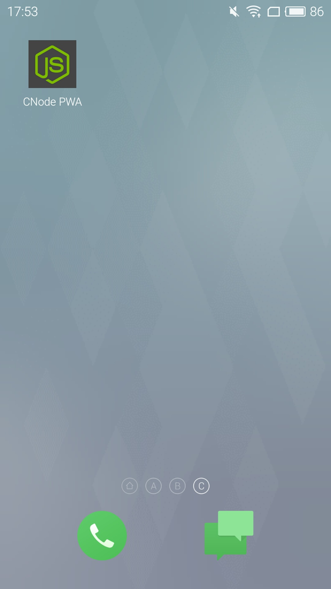
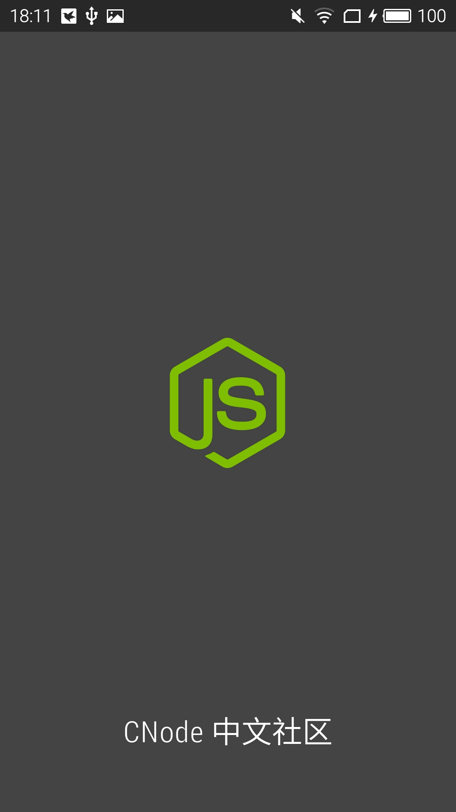
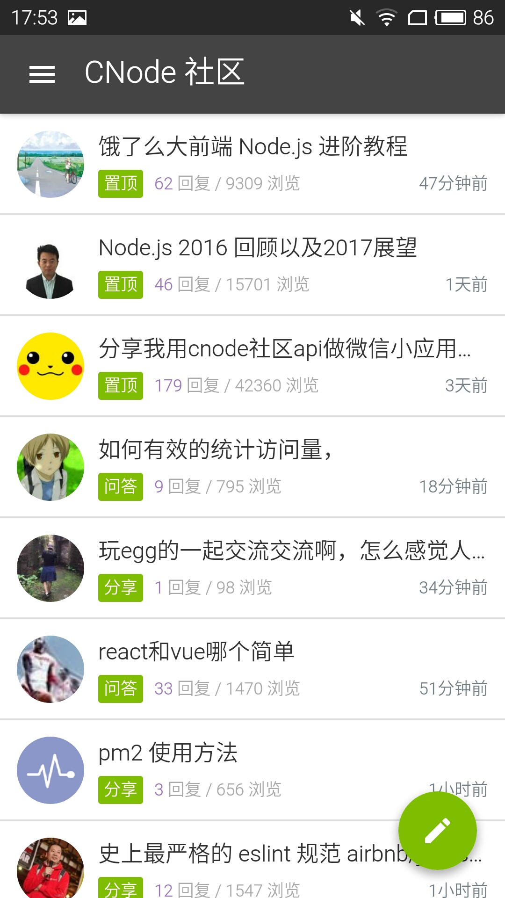
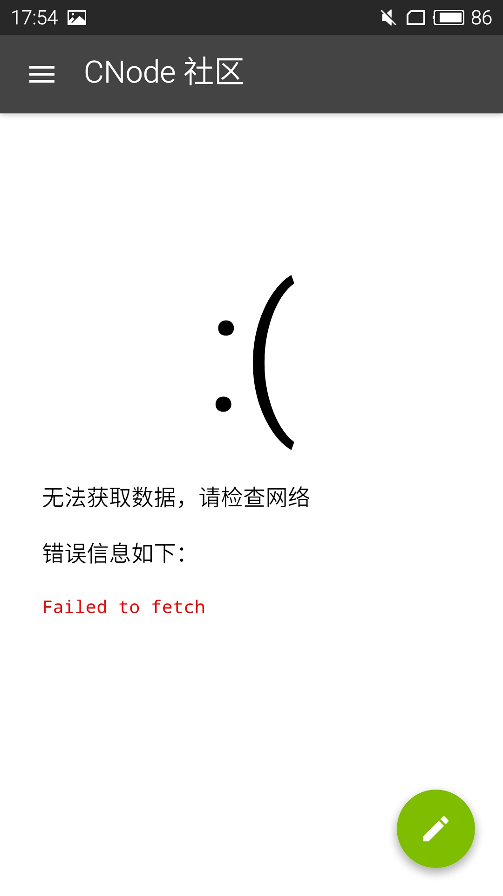
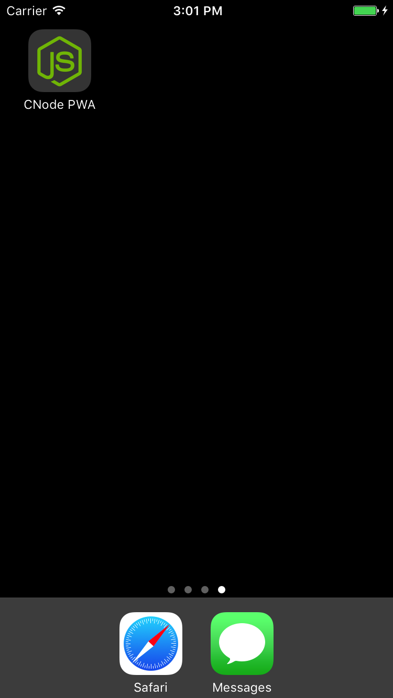
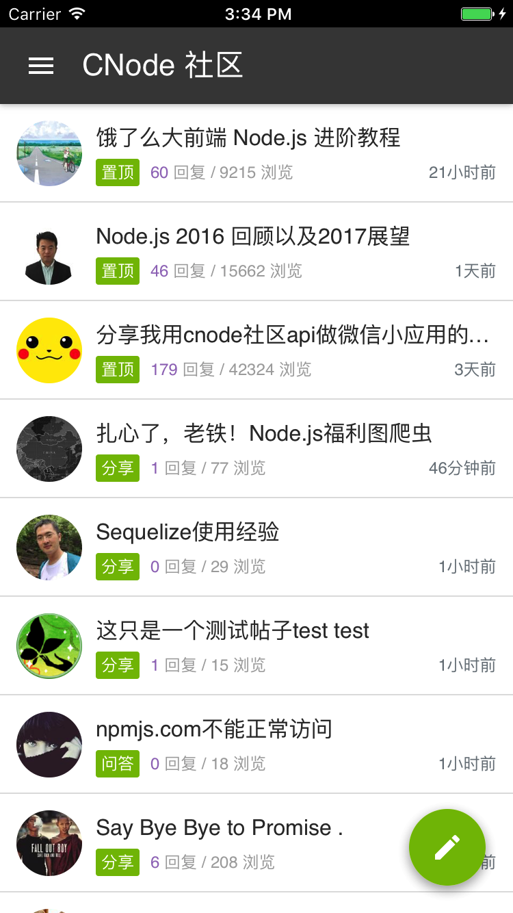

[README in English](README.en.md)

# CNode PWA

CNode PWA 是使用 React，React Router 和 Redux 构建的 Progressive Web App。

https://pd4d10.github.io/cnode-pwa/

移动设备可扫描以下二维码访问：

## 安装

### Android

安装 Google Chrome 浏览器，访问链接，点击右上角图标，选择“添加到主屏幕”。

有了 service worker 的加持，拥有首屏图片，离线访问等能力。

### iOS

使用 Safari 浏览器访问链接，点击下方正中央的图标，选择“添加到主屏幕”。

目前 iOS Safari 不支持 service worker，所以没有离线访问的能力。

## 截图

### Android

### iOS

## 致谢

* [CNode 社区](https://cnodejs.org/api) 提供的 API
* [CNode Material Design](https://github.com/TakWolf/CNode-Material-Design) 参考了样式

## 许可证

MIT
